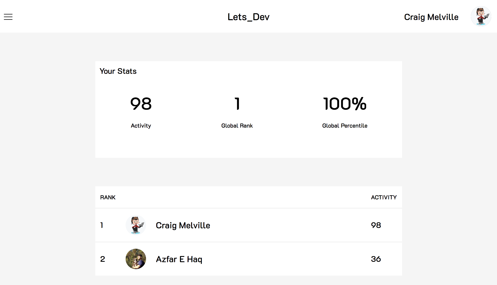
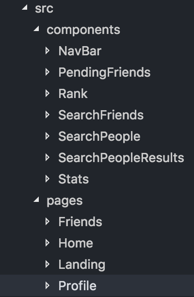

# Lets_Dev

Lets Dev is a social accountability platform for developers that tracks your Github activity and then ranks you against your friends to help keep everyone coding.

[Live Site](https://letsdev.herokuapp.com/)



## Tech Stack

-   React
    -   React Router Dom
    -   React Cookie
    -   Axios
-   UIkit
-   Node.js
    -   Sequelize
    -   Octokit
-   Express
-   Github Authorization
-   Postgres
-   Heroku

## Front-end

The frontend is built entirely with React, along with React Router and UIkit. The design is purposefully kept very minimal to focus the user their rank and stats.

We choose to use React specifically because we have many repeating elements, including your stats, the nav bar and lists of other users. You can see our final pages and compoentes in the file tree below.



Additionaly we used Axios to make our API calls from the frontend to the back. As you can see we ended up with quite a few.

```
    getUserProfile: function(username) {
        return axios.get("/api/users/" + username);
    },
    getAllUsers: function() {
        return axios.get("/api/users/");
    },
    displayFriends: function(id) {
        return axios.get("/api/friends/" + id);
    },
    checkUpdates: function(id) {
        return axios.post("/api/updateCheck/" + id);
    },
    updateNew: function(id) {
        return axios.post("/api/updateNew/" + id);
    },
    compileActivity: function(id) {
        return axios.post("/api/compileUpdate/" + id);
    },
    createRequest: function(req) {
        //post obj to req.body. user id friend id
        return axios.post("/api/request", req);
    },
    acceptRequest: function(req) {
        //post obj to req.body. user id friend id
        return axios.put("/api/request", req);
    },
    displayRequests: function(id) {
        return axios.get("/api/request/" + id);
    },
    login: function(username) {
        return axios.get("/api/login/" + username);
    },
    signUp: function(req) {
        return axios.post("/api/signup", req);
    },
    search: function(query) {
        return axios.get("api/search/" + query);
    }
```

## Back-end

The back-end of this application is built primarily through express and node.js, and relies on Sequelize to manage the organization and modification of our postgres database.

The postgres database currently features the 4 following models:

- Users
    - This model holds our Users, their profile information, and their current activity score.
- Days
    - This model keeps track of the calendar days on which any of our users have been active on github. 
- UsersDays
    - This relational model between users and days stores the amount of activity of any given user on any given day.
- Friendship
    - This relational model which governs friendships, keeps track friendships, requests, and whether requests have been accepted.
    
One of the more complicated processes on our back-end is the process in which user's activities are updated. This process uses Octokit, github's node package for interacting with their API, to pull publicly available activity information from a user's profile when a call is made with their username. Once that call is made, a list of objects detailing each of the user's activities and when the actions were made is returned.

In order to check for updates, and compile updated activity, we must first check how long it has been since the row for any given user has been updated. If it has yet to be updated today, the logic proceeds as follows. 

- Set variables for today as the day being updated, the initial activity for that day as 0, and the last updated day as the furthest back we are looking
- Look at each item in the list:
    - If the date of the listed activity is the day we are updating: 
        - Increment the day's activity by 1 and check the next item.
    - If the date of the listed activity is before the day we are updating:
        - Update the user-day relationship to show the total activity on this day 
            - (This involves a layered process for creating rows for days and relations for users-days in our database, which requires multiple iterative functions and several calls to the database for checking creating and updating.)
        - Then we change the day we are updating to be the day listed on this last checked activity.
        - We set the activity for this new day equal to one and move on to the next day.
    - If the date of the listed activity is earlier than our cutoff date, or we run out of items to look at:
        - This process requires pulling the daily activity for the user on each day for the past month from the database, then incrementing an activity score by examining each one, before updating the score to reflect the final calculation.
        
During the process listed out above, many interactions with the database are made, so segmenting these functions, while also using callbacks and async are necessary to ensure that the data is returned without error or timeouts. We check whether updates are necessary on each user whenever our app is used so that our information does not end up becoming outdated.
 
## Authors

[Laura Lee](https://github.com/lalatw)

[Azfar Haq](https://github.com/aehaq)

[Craig Melville](https://github.com/acekreations)
